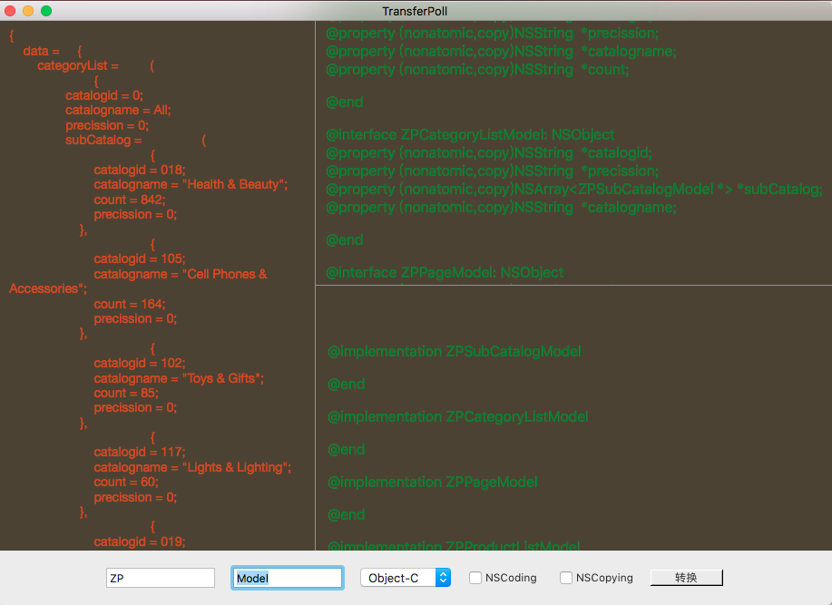

# KVTransferPoll
json转对象工具：将服务器返回的json数据转换为Obj-C Model、Swift Model或Swift Struct对象。

## 功能：
1. 支持转换为Obj-C Model、Swift Model或Swift Struct对象。
2. 转换生成对象时，支持添加自定义前缀、后缀。
3. 添加NSCoding协议，自动补全相关方法实现和属性定制。
4. 添加NSCopying协议，自动补全相关方法。
5. 待添加功能：待定

## 问题：
1. 目前针对基本类型，比如NSInteger、CGFloat等无法进行精确的定位，可能后续需要手动检测和修改。
2. 运行项目期间，有可能会出现`SnapKit`库编译错误，此时需要重新编译该库即可。

	> 1. 本项目三方库使用`Carthage`管理。
	> 2. 错误：Module compiled with Swift 4.0 cannot be imported in Swift 4.0.3: **/SnapKit.framework/Modules/SnapKit.swiftmodule/x86_64.swiftmodule

## 运行效果如下图：

